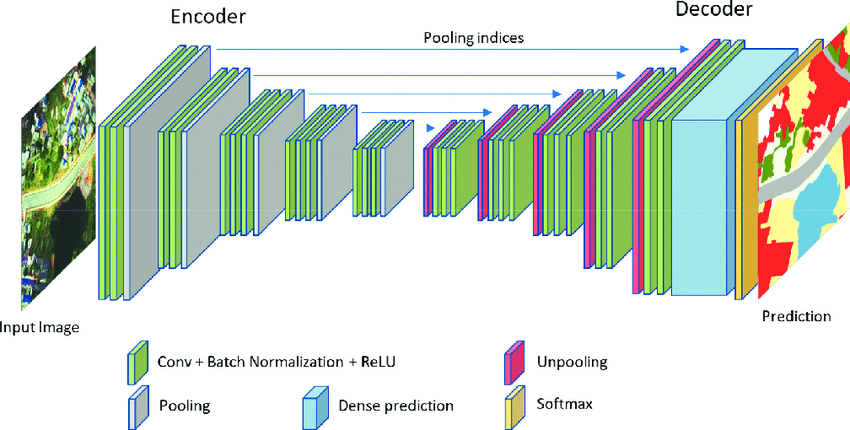
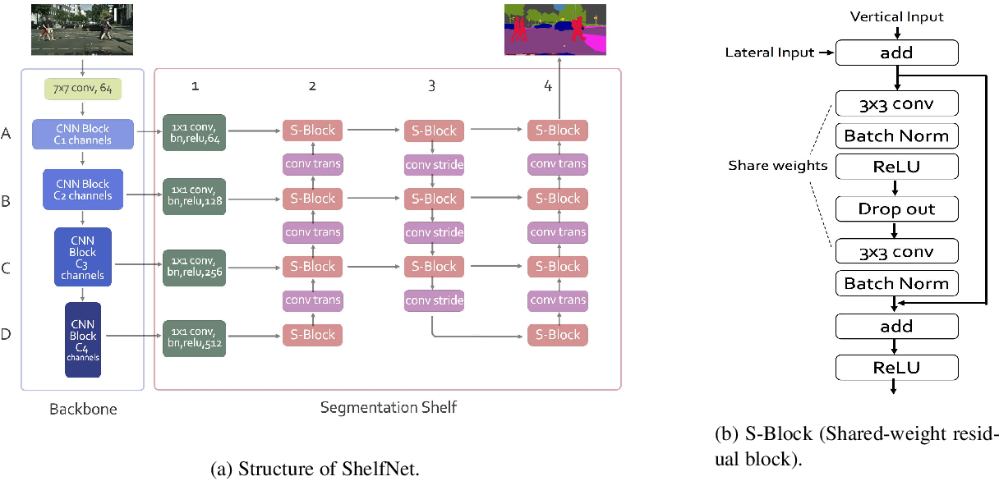

# Water Bodies Satelite Image Segmentation

Apply Semantic segmenation techniques such as UNet, DeepLab, FCN, ShelfNet and SegNet to water bodies satelite images and deploy using flask and streamlit

## Dataset - [Satellite Images of Water Bodies](https://www.kaggle.com/datasets/franciscoescobar/satellite-images-of-water-bodies)
A collection of water bodies images captured by the Sentinel-2 Satellite. Each image comes with a black and white mask where white represents water and black represents something else but water. The masks were generated by calculating the NWDI (Normalized Water Difference Index) which is frequently used to detect and measure vegetation in satellite images, but a greater threshold was used to detect water bodies.

## How to try it?

## Architectures

### 1. U-Net

### 2. FCN-8 (Fully Convolutional Network)

### 3. SegNet

### 4. ShelfNet

### 5. DeepLabV3

## Results
|Model|Loss (binary cross entropy)|Dice|iou|epochs|
|--|--|--|--|--|
|U-Net|-|-|-|-|
|FCN-8|-|-|-|-|
|SegNet|-|-|-|-|
|ShelfNet|-|-|-|-|
|DeepLabv3|-|-|-|-|

## Project Structure

## Tools
- Python
- Tensorflow
- streamlit
- flask

## References
- [U-Net: Convolutional Networks for Biomedical Image Segmentation](https://arxiv.org/abs/1505.04597v1)
- [Fully Convolutional Networks for Semantic Segmentation](https://arxiv.org/abs/1605.06211v1)
- [SegNet: A Deep Convolutional Encoder-Decoder Architecture for Image Segmentation](https://arxiv.org/abs/1511.00561v3.pdf)
- [ShelfNet for Fast Semantic Segmentation](https://arxiv.org/abs/1811.11254v6)
- [Rethinking Atrous Convolution for Semantic Image Segmentation](https://arxiv.org/abs/1706.05587v3)
